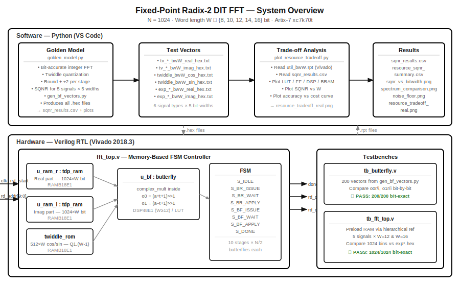
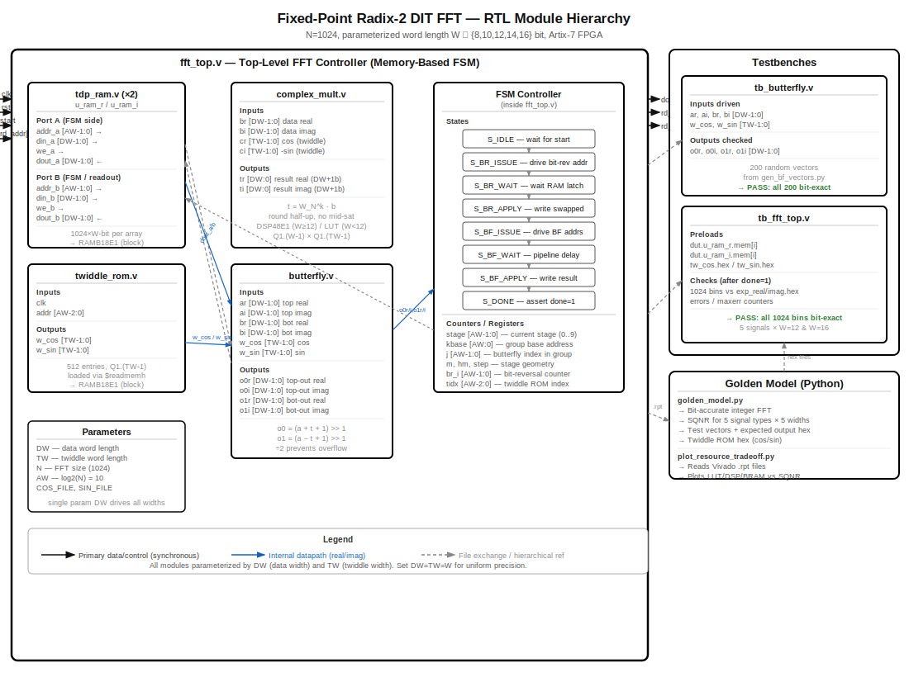

# FFT-Fixed-Point-FPGA

**Fixed-Point Radix-2 DIT FFT — Bit-Width Trade-off Study on FPGA**

A research project carried out as part of the NCKH undergraduate research program at FPT University. The system implements a 1024-point fixed-point Radix-2 Decimation-in-Time (DIT) FFT whose data word length can be configured to 8, 10, 12, 14, or 16 bits. The core question being investigated is how much signal quality (measured by SQNR) is lost as the word length is reduced, and how much FPGA hardware area (LUT, FF, DSP, Block RAM) is saved in return.

---

## System Block Diagram — Top Level



The overall flow is split into a software side and a hardware side:

- The **software side** (Python scripts, run in VS Code) handles the bit-accurate reference simulation, generates all test vectors and twiddle ROM initialization files, and reads Vivado synthesis reports to produce the trade-off plots.
- The **hardware side** (Verilog RTL, simulated and synthesized in Vivado 2018.3) implements the actual FFT datapath and is verified against the software reference bit-by-bit.

---

## Module Hierarchy — RTL Block Diagram



---

## Project File Tree

```
FFT-Fixed-Point-FPGA/
│
├── golden_model/
│   ├── golden_model.py              # Bit-accurate fixed-point FFT simulation and SQNR analysis
│   ├── gen_bf_vectors.py            # Generates 200 butterfly test vectors for RTL verification
│   └── plot_resource_tradeoff.py    # Reads Vivado .rpt files and plots resource vs SQNR curves
│
├── rtl/
│   ├── complex_mult.v               # Parameterized complex multiplier
│   ├── butterfly.v                  # Radix-2 DIT butterfly with per-stage overflow scaling
│   ├── twiddle_rom.v                # Twiddle factor ROM, loaded via $readmemh
│   ├── fft_top.v                    # Top-level FFT: dual-port BRAM + FSM controller
│   └── fft_top.xdc                  # Timing constraint (100 MHz target clock)
│
├── tb/
│   ├── tb_butterfly.v               # Self-checking butterfly testbench — 200 vectors
│   └── tb_fft_top.v                 # Self-checking FFT testbench — 1024 output bins
│
├── vivado_reports/
│   ├── util_bw8.rpt                 # Vivado utilization report — W = 8 bit
│   ├── util_bw10.rpt                # Vivado utilization report — W = 10 bit
│   ├── util_bw12.rpt                # Vivado utilization report — W = 12 bit
│   ├── util_bw14.rpt                # Vivado utilization report — W = 14 bit
│   └── util_bw16.rpt                # Vivado utilization report — W = 16 bit
│
├── results/
│   ├── sqnr_results.csv             # SQNR for each signal type across all bit-widths
│   └── resource_sqnr_summary.csv    # Combined hardware cost and SQNR summary
│
├── plots/
│   ├── sqnr_vs_bitwidth.png         # SQNR vs W — four signal types
│   ├── spectrum_comparison.png      # Single-tone output spectrum across all five bit-widths
│   ├── noise_floor.png              # Quantization noise floor per frequency bin
│   └── resource_tradeoff_real.png   # Hardware cost vs SQNR — from real Vivado data
│
├── docs/
│   ├── fft_block_diagram.svg        # Top-level system block diagram
│   └── fft_module_diagram.svg       # RTL module hierarchy diagram
│
└── references/
    └── references.md                # Related papers and references
```

> `test_vectors/` and `expected_output/` are excluded from the repository because they contain hundreds of large hex files. Both folders are regenerated locally by running `golden_model.py`.

---

## RTL Module Descriptions

### `complex_mult.v` — Parameterized Complex Multiplier

Computes the twiddle rotation **t = W_N^k · b**, where the twiddle factor is represented as `cr + j·ci = cos − j·sin`.

| Signal | Direction | Width | Description |
|---|---|---|---|
| `br` | input | `[DW-1:0]` | Bottom operand — real part |
| `bi` | input | `[DW-1:0]` | Bottom operand — imaginary part |
| `cr` | input | `[TW-1:0]` | Twiddle real part (cos) |
| `ci` | input | `[TW-1:0]` | Twiddle imaginary part (−sin) |
| `tr` | output | `[DW:0]` | Result real part (DW+1 bits, no mid-saturation) |
| `ti` | output | `[DW:0]` | Result imaginary part (DW+1 bits, no mid-saturation) |

- Format: Q1.(W−1) data × Q1.(TW−1) twiddle, result rounded to Q2.(W−1).
- One extra integer bit is kept in the output to avoid premature saturation when the complex magnitude exceeds 1.0.
- At W ≥ 12, Vivado maps this to **DSP48E1** blocks. At W < 12, LUT-based multipliers are used instead (DSP = 0), since small operands do not justify a full 25×18-bit hardware multiplier.

---

### `butterfly.v` — Radix-2 DIT Butterfly with Overflow Scaling

Performs one butterfly operation:
- `o0 = (a + t + 1) >> 1` — top output
- `o1 = (a − t + 1) >> 1` — bottom output

The arithmetic right shift by 1 (divide-by-2 with round-half-up) is applied after each butterfly stage to prevent overflow. After log₂(N) = 10 stages, the output represents DFT{x}/N.

| Signal | Direction | Width | Description |
|---|---|---|---|
| `ar` | input | `[DW-1:0]` | Top input — real |
| `ai` | input | `[DW-1:0]` | Top input — imaginary |
| `br` | input | `[DW-1:0]` | Bottom input — real |
| `bi` | input | `[DW-1:0]` | Bottom input — imaginary |
| `w_cos` | input | `[TW-1:0]` | Twiddle cosine from ROM |
| `w_sin` | input | `[TW-1:0]` | Twiddle sine from ROM |
| `o0r` | output | `[DW-1:0]` | Top output — real |
| `o0i` | output | `[DW-1:0]` | Top output — imaginary |
| `o1r` | output | `[DW-1:0]` | Bottom output — real |
| `o1i` | output | `[DW-1:0]` | Bottom output — imaginary |

- Instantiates `complex_mult.v` internally.
- Output is saturated to the W-bit signed range before being written back.
- Fully combinational (no registered outputs); the FSM controls when results are written.

---

### `twiddle_rom.v` — Twiddle Factor ROM

Stores N/2 = 512 entries of cos(2πk/N) and sin(2πk/N) in Q1.(TW−1) format. Contents are loaded at simulation startup via `$readmemh` from `tw_cos.hex` and `tw_sin.hex`.

| Signal | Direction | Width | Description |
|---|---|---|---|
| `clk` | input | 1 | Clock |
| `addr` | input | `[AW-2:0]` | Read address (0 to N/2−1) |
| `w_cos` | output | `[TW-1:0]` | Registered cosine value |
| `w_sin` | output | `[TW-1:0]` | Registered sine value |

- Registered read output (1-cycle read latency) matches the BRAM read behavior.
- The `rom_style = "block"` attribute is applied so Vivado maps the ROM to **RAMB18E1**.

---

### `tdp_ram.v` (instantiated as `u_ram_r` and `u_ram_i` inside `fft_top.v`)

True dual-port RAM with 1024 entries × W bits. One instance stores the real part of the working data array, the other stores the imaginary part. The two-port structure lets the FSM simultaneously read and write two addresses per cycle.

| Signal | Direction | Width | Description |
|---|---|---|---|
| `clk` | input | 1 | Clock |
| `addr_a` | input | `[AW-1:0]` | Port A address |
| `addr_b` | input | `[AW-1:0]` | Port B address |
| `din_a` | input | `[DW-1:0]` | Port A write data |
| `din_b` | input | `[DW-1:0]` | Port B write data |
| `we_a` | input | 1 | Port A write enable |
| `we_b` | input | 1 | Port B write enable |
| `dout_a` | output | `[DW-1:0]` | Port A read data (registered, 1-cycle latency) |
| `dout_b` | output | `[DW-1:0]` | Port B read data (registered, 1-cycle latency) |

- Each port has its own independent `always` block — the standard Xilinx template that enables **RAMB18E1** inference.
- The `ram_style = "block"` attribute is applied explicitly. Without this, early versions of the code caused Vivado to dissolve the RAM into ~2000 individual flip-flops, making synthesis take over 30 minutes instead of ~25 seconds.

---

### `fft_top.v` — Top-Level FFT Controller

The top-level module that wires together all sub-modules and controls the computation through a multi-state FSM. A single shared butterfly is reused across all N/2 × log₂(N) operations, keeping the area footprint small.

| Signal | Direction | Width | Description |
|---|---|---|---|
| `clk` | input | 1 | System clock |
| `rst` | input | 1 | Synchronous reset (active-high) |
| `start` | input | 1 | Pulse high for one cycle to begin an FFT |
| `done` | output | 1 | Goes high for one cycle when the FFT is complete |
| `rd_addr` | input | `[AW-1:0]` | Read address for output scan-out |
| `rd_data_r` | output | `[DW-1:0]` | Output bin real part (valid 2 cycles after rd_addr) |
| `rd_data_i` | output | `[DW-1:0]` | Output bin imaginary part (valid 2 cycles after rd_addr) |

**FSM states and sequence:**

| State | Action |
|---|---|
| `S_IDLE` | Waits for `start`. Port B is driven by `rd_addr` for scan-out. |
| `S_BR_ISSUE` | Drives read addresses for the bit-reversal pair (i, bitrev(i)). Only pairs where bitrev(i) > i are swapped. |
| `S_BR_WAIT` | Waits one cycle for the registered RAM read to settle. |
| `S_BR_APPLY` | Writes the swapped values back. Advances to the next index. |
| `S_BF_ISSUE` | Drives Port A = kbase+j, Port B = kbase+j+hm, and the twiddle ROM address. |
| `S_BF_WAIT` | Waits one cycle for RAM and twiddle registers to settle. |
| `S_BF_APPLY` | Reads butterfly outputs (combinational) and writes results back. Advances j, kbase, stage. |
| `S_DONE` | Asserts `done = 1` for one cycle, then returns to `S_IDLE`. |

**Parameters:**

| Parameter | Default | Description |
|---|---|---|
| `DW` | 16 | Data word length — set this to change the bit-width |
| `TW` | 16 | Twiddle word length — normally set equal to DW |
| `N` | 1024 | FFT size |
| `AW` | 10 | log₂(N) |
| `COS_FILE` | `tw_cos.hex` | Twiddle cosine initialization file |
| `SIN_FILE` | `tw_sin.hex` | Twiddle sine initialization file |

---

## Testbench Descriptions

### `tb_butterfly.v`

A self-checking testbench that drives 200 pre-computed input vectors into the butterfly and compares every output against the golden reference. Vectors are read from `bf_vectors.txt`, which is generated by `gen_bf_vectors.py` using the same integer arithmetic as the golden model.

| Item | Value |
|---|---|
| Number of test vectors | 200 |
| Signal types | Random inputs at ±full-scale |
| Pass criterion | Every output bit matches the golden reference |
| Result | **PASS — 200/200 bit-exact** |

### `tb_fft_top.v`

A self-checking testbench that runs a complete 1024-point FFT and compares all output bins against the golden expected values. Input data is preloaded directly into `dut.u_ram_r.mem` and `dut.u_ram_i.mem` using hierarchical references, so no I/O wrapper is needed for verification.

| Item | Value |
|---|---|
| FFT size | 1024 points |
| Signal types tested | single_tone, multi_tone, random_noise, max_value, impulse |
| Bit-widths verified | W = 12 and W = 16 |
| Pass criterion | All 1024 output bins match the golden expected values |
| Result | **PASS — 1024/1024 bins bit-exact** |

---

## Key Results

### SQNR vs Word Length — N = 1024

| Signal type | W=8 | W=10 | W=12 | W=14 | W=16 |
|---|---|---|---|---|---|
| Single tone | 10.2 dB | 22.1 dB | 34.4 dB | 46.3 dB | 58.4 dB |
| Multi tone | 7.2 dB | 19.8 dB | 31.2 dB | 43.5 dB | 55.4 dB |
| Full-scale DC | 15.3 dB | 27.3 dB | 39.4 dB | 51.4 dB | 63.4 dB |
| Random noise (avg) | 2.5 dB | 14.5 dB | 26.5 dB | 38.5 dB | 50.6 dB |

SQNR improves by roughly 6 dB per added bit, and sits about 40 dB below the input-quantization-only bound — the gap is exactly the processing noise that accumulates across the 10 butterfly stages.

### Hardware Resources — Artix-7 xc7k70tfbv676-1, Vivado 2018.3

| W | LUT | Flip-Flop | Block RAM Tile | DSP48E1 |
|---|---|---|---|---|
| 8  | 581 | 138 | 2 | 0 |
| 10 | 829 | 146 | 2 | 0 |
| 12 | 341 | 154 | 2 | 5 |
| 14 | 366 | 162 | 2 | 5 |
| 16 | 383 | 170 | 2 | 5 |

At W = 8 and W = 10, no DSP blocks are used — Vivado builds the multiplier from LUTs because small operands do not efficiently fill a 25×18-bit DSP48E1 block. From W = 12 onward, five DSP blocks are inferred and the LUT count drops noticeably. This crossover is one of the main findings of the study.

---

## How to Reproduce

### Step 1 — Install Python dependencies

```bash
pip install numpy matplotlib
```

### Step 2 — Generate test vectors and SQNR plots

```bash
cd golden_model
python golden_model.py
python gen_bf_vectors.py
```

After this, the `test_vectors/`, `expected_output/`, `results/`, and `plots/` folders will be populated.

### Step 3 — Run the butterfly testbench

```bash
cd tb
iverilog -g2012 -o sim_bf tb_butterfly.v ../rtl/butterfly.v ../rtl/complex_mult.v
vvp sim_bf
```

Expected:
```
BUTTERFLY PASS: all 200 vectors bit-exact vs golden
```

### Step 4 — Run the full FFT testbench (example: single tone, W = 16)

```bash
cd sim
cp ../test_vectors/twiddle_bw16_cos_hex.txt tw_cos.hex
cp ../test_vectors/twiddle_bw16_sin_hex.txt tw_sin.hex
cp ../test_vectors/tv_single_tone_bw16_real_hex.txt in_real.hex
cp ../test_vectors/tv_single_tone_bw16_imag_hex.txt in_imag.hex
cp ../expected_output/exp_single_tone_bw16_real_hex.txt exp_real.hex
cp ../expected_output/exp_single_tone_bw16_imag_hex.txt exp_imag.hex
iverilog -g2012 -o sim_top ../tb/tb_fft_top.v ../rtl/fft_top.v \
         ../rtl/butterfly.v ../rtl/complex_mult.v
vvp sim_top
```

Expected:
```
FFT_TOP PASS: all 1024 bins bit-exact vs golden
```

To test a different word length (for example W = 12), compile with `-Pfft_top.DW=12 -Pfft_top.TW=12` and use the matching `bw12` files.

### Step 5 — Run Vivado simulation

Open the Vivado project, set `tb_fft_top` as the simulation top, copy the six `.hex` files to the `xsim` working directory, then run:

```tcl
set_property generic {DW=16 TW=16} [get_filesets sim_1]
run -all
```

The Tcl Console should print `FFT_TOP PASS`.

### Step 6 — Run Vivado synthesis for each bit-width

For each W in {8, 10, 12, 14, 16}:

1. Copy the matching twiddle files into `rtl/` (renamed to `tw_cos.hex` / `tw_sin.hex`).
2. In the Vivado Tcl Console:
   ```tcl
   set_property generic {DW=W TW=W} [get_filesets sources_1]
   ```
3. Set `fft_top` as the top module and run Synthesis.
4. Save the report as `vivado_reports/util_bwW.rpt`.

### Step 7 — Generate the trade-off plots from real Vivado data

```bash
cd golden_model
# Place all five util_bwX.rpt files in this folder first
python plot_resource_tradeoff.py
```

Output: `plots/resource_tradeoff_real.png` and `results/resource_sqnr_summary.csv`.

---

## Design Parameters

| Parameter | Value |
|---|---|
| FFT size (N) | 1024 points |
| Algorithm | Radix-2 Decimation-in-Time (DIT), Cooley–Tukey |
| Architecture | Memory-based, single shared butterfly — area-efficient |
| Number format | Q1.(W−1) two's-complement signed fixed-point |
| Overflow protection | Fixed ÷2 scaling (arithmetic right shift) after every stage |
| Twiddle factors | Quantized to Q1.(TW−1), loaded at startup via `$readmemh` |
| Target device | Xilinx Artix-7 xc7k70tfbv676-1 |
| Tools | Vivado 2018.3, Python 3.x |

---

## Verification Summary

| Test | Result |
|---|---|
| Butterfly — 200 random vectors | ✅ All 200 bit-exact vs golden model |
| Full 1024-pt FFT — 5 signal types, W=16 | ✅ All 1024 bins bit-exact |
| Full 1024-pt FFT — single tone, W=12 | ✅ All 1024 bins bit-exact |
| Vivado synthesis — all 5 bit-widths | ✅ 0 errors, 0 critical warnings |
| BRAM inference | ✅ RAM correctly mapped to RAMB18E1 blocks |

---

## Team

Undergraduate research group (NCKH) — School of Electrical and Electronics Engineering, FPT University.

- Hoàng Ngọc Gia Bão
- Trần Hồ Khánh Tân
- Nguyễn Trọng Hùng
- Nguyễn Quế Vũ
- Nguyễn Việt Anh
