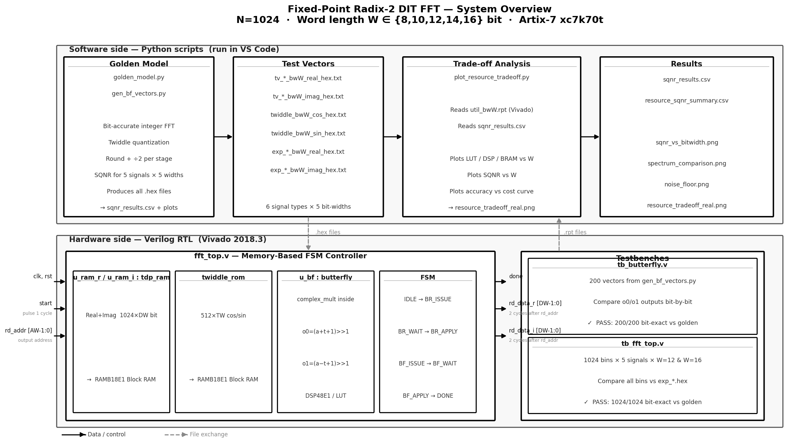
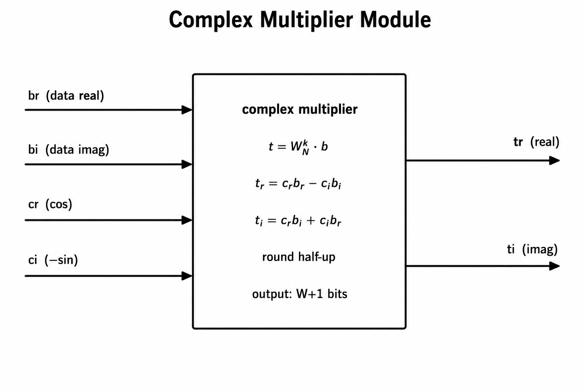
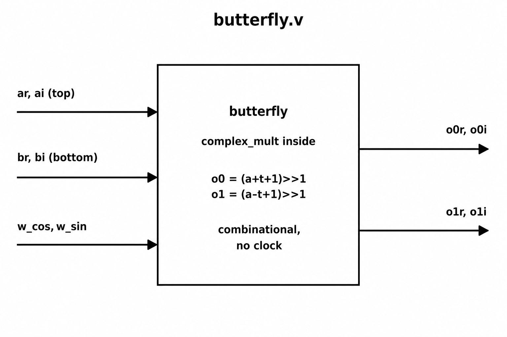
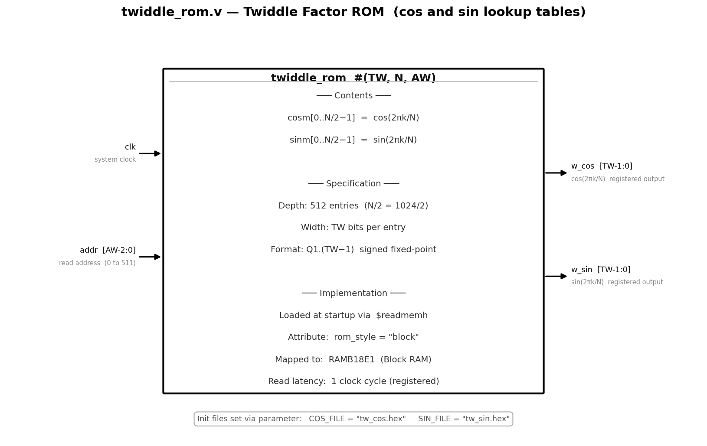
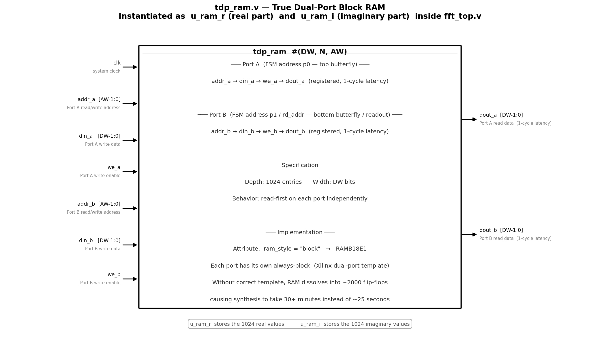
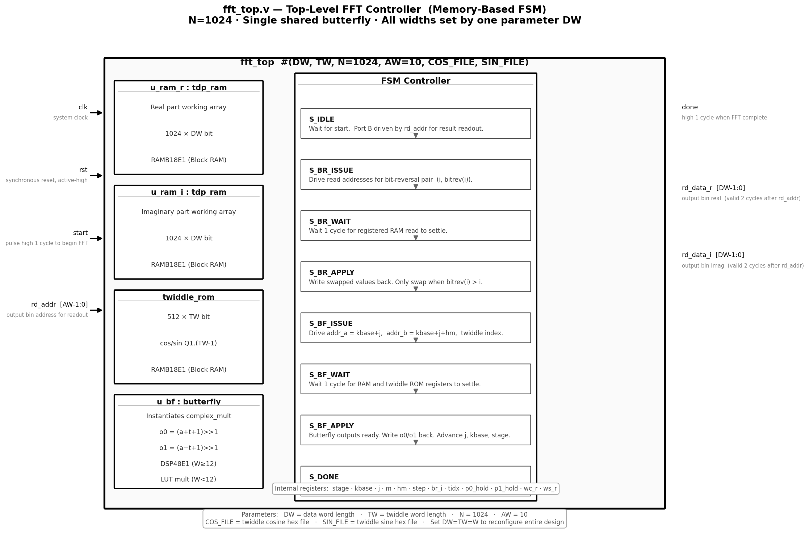

# FFT-Fixed-Point-FPGA

**Fixed-Point Radix-2 DIT FFT — Bit-Width Trade-off Study on FPGA**

A research project carried out as part of the NCKH undergraduate research program at FPT University. The system implements a 1024-point fixed-point Radix-2 Decimation-in-Time (DIT) FFT whose data word length can be configured to 8, 10, 12, 14, or 16 bits. The core question being investigated is how much signal quality (measured by SQNR) is lost as the word length is reduced, and how much FPGA hardware area (LUT, FF, DSP, Block RAM) is saved in return.

---

## System Overview



The overall flow is split into two sides:

- The **software side** (Python scripts, run in VS Code) handles the bit-accurate reference simulation, generates all test vectors and twiddle ROM initialization files, and reads Vivado synthesis reports to produce the trade-off plots.
- The **hardware side** (Verilog RTL, synthesized in Vivado 2018.3) implements the actual FFT datapath and gets verified against the software reference bit-by-bit.

---

## Project File Tree

```
FFT-Fixed-Point-FPGA/
│
├── golden_model/
│   ├── golden_model.py              # Bit-accurate fixed-point FFT simulation and SQNR analysis
│   ├── gen_bf_vectors.py            # Generates 200 butterfly test vectors for RTL verification
│   └── plot_resource_tradeoff.py    # Reads Vivado .rpt files and plots resource vs SQNR curves
│
├── rtl/
│   ├── complex_mult.v               # Parameterized complex multiplier
│   ├── butterfly.v                  # Radix-2 DIT butterfly with per-stage overflow scaling
│   ├── twiddle_rom.v                # Twiddle factor ROM, loaded via $readmemh
│   ├── fft_top.v                    # Top-level FFT: dual-port BRAM + FSM controller
│   └── fft_top.xdc                  # Timing constraint (100 MHz target clock)
│
├── tb/
│   ├── tb_butterfly.v               # Self-checking butterfly testbench — 200 vectors
│   └── tb_fft_top.v                 # Self-checking FFT testbench — 1024 output bins
│
├── vivado_reports/
│   ├── util_bw8.rpt                 # Vivado utilization report — W = 8 bit
│   ├── util_bw10.rpt                # Vivado utilization report — W = 10 bit
│   ├── util_bw12.rpt                # Vivado utilization report — W = 12 bit
│   ├── util_bw14.rpt                # Vivado utilization report — W = 14 bit
│   └── util_bw16.rpt                # Vivado utilization report — W = 16 bit
│
├── results/
│   ├── sqnr_results.csv             # SQNR for each signal type across all bit-widths
│   └── resource_sqnr_summary.csv    # Combined hardware cost and SQNR summary
│
├── plots/
│   ├── sqnr_vs_bitwidth.png
│   ├── spectrum_comparison.png
│   ├── noise_floor.png
│   └── resource_tradeoff_real.png
│
├── docs/
│   ├── fft_block_diagram.svg        # System overview diagram
│   ├── fft_module_diagram.svg       # RTL hierarchy diagram
│   ├── module_complex_mult.svg
│   ├── module_butterfly.svg
│   ├── module_twiddle_rom.svg
│   ├── module_tdp_ram.svg
│   └── module_fft_top.svg
│
└── references/
    └── references.md
```

> `test_vectors/` and `expected_output/` are excluded from the repo because they contain hundreds of large hex files. Both folders are regenerated locally by running `golden_model.py`.

---

## RTL Module Descriptions

### `complex_mult.v`



Computes the twiddle rotation **t = W_N^k · b**, where the twiddle factor is `cr + j·ci = cos − j·sin`. One extra integer bit is kept in the output to avoid premature saturation when the complex operand magnitude exceeds 1.0. At W ≥ 12 Vivado maps the multiplications to DSP48E1 blocks; at W < 12 LUT-based multipliers are used instead.

| Signal | Direction | Width | Description |
|---|---|---|---|
| `br` | input | `[DW-1:0]` | Bottom operand — real part |
| `bi` | input | `[DW-1:0]` | Bottom operand — imaginary part |
| `cr` | input | `[TW-1:0]` | Twiddle real part (cos) |
| `ci` | input | `[TW-1:0]` | Twiddle imaginary part (−sin) |
| `tr` | output | `[DW:0]` | Result real (DW+1 bits, no mid-saturation) |
| `ti` | output | `[DW:0]` | Result imaginary (DW+1 bits, no mid-saturation) |

---

### `butterfly.v`



Performs one Radix-2 DIT butterfly step. The arithmetic right shift by 1 (round-half-up ÷2) applied after each stage prevents overflow from propagating through all 10 stages. After log₂(1024) = 10 stages the output represents DFT{x}/N. This module is fully combinational — no clock port.

| Signal | Direction | Width | Description |
|---|---|---|---|
| `ar` | input | `[DW-1:0]` | Top input — real |
| `ai` | input | `[DW-1:0]` | Top input — imaginary |
| `br` | input | `[DW-1:0]` | Bottom input — real |
| `bi` | input | `[DW-1:0]` | Bottom input — imaginary |
| `w_cos` | input | `[TW-1:0]` | Twiddle cosine from ROM |
| `w_sin` | input | `[TW-1:0]` | Twiddle sine from ROM |
| `o0r` | output | `[DW-1:0]` | Top output — real |
| `o0i` | output | `[DW-1:0]` | Top output — imaginary |
| `o1r` | output | `[DW-1:0]` | Bottom output — real |
| `o1i` | output | `[DW-1:0]` | Bottom output — imaginary |

---

### `twiddle_rom.v`



Stores 512 entries of cos(2πk/N) and sin(2πk/N) in Q1.(TW−1) format. Contents are loaded at simulation startup via `$readmemh`. The `rom_style = "block"` attribute directs Vivado to map the ROM to a RAMB18E1 block.

| Signal | Direction | Width | Description |
|---|---|---|---|
| `clk` | input | 1 | System clock |
| `addr` | input | `[AW-2:0]` | Read address (0 to 511) |
| `w_cos` | output | `[TW-1:0]` | Registered cosine — 1-cycle read latency |
| `w_sin` | output | `[TW-1:0]` | Registered sine — 1-cycle read latency |

---

### `tdp_ram.v` (instantiated as `u_ram_r` and `u_ram_i`)



True dual-port synchronous RAM with 1024 × W-bit storage. Instantiated twice inside `fft_top.v` — one for the real part array and one for the imaginary part. The two independent port `always` blocks follow the standard Xilinx template that enables RAMB18E1 inference. Without this structure, early versions of the code caused Vivado to dissolve the RAM into ~2000 individual flip-flops, making synthesis take over 30 minutes.

| Signal | Direction | Width | Description |
|---|---|---|---|
| `clk` | input | 1 | System clock |
| `addr_a` | input | `[AW-1:0]` | Port A address |
| `din_a` | input | `[DW-1:0]` | Port A write data |
| `we_a` | input | 1 | Port A write enable |
| `dout_a` | output | `[DW-1:0]` | Port A read data (registered, 1-cycle latency) |
| `addr_b` | input | `[AW-1:0]` | Port B address |
| `din_b` | input | `[DW-1:0]` | Port B write data |
| `we_b` | input | 1 | Port B write enable |
| `dout_b` | output | `[DW-1:0]` | Port B read data (registered, 1-cycle latency) |

---

### `fft_top.v`



Top-level module that wires together all sub-modules and drives a multi-state FSM. A single shared butterfly is reused across all N/2 × log₂(N) = 5120 operations, keeping area small. The `rd_addr` / `rd_data_r` / `rd_data_i` read-out port allows the host to scan out results after `done` goes high — and also ensures Vivado cannot optimize away the entire datapath during synthesis (a module with no observable output ports would have its internal logic stripped).

| Signal | Direction | Width | Description |
|---|---|---|---|
| `clk` | input | 1 | System clock |
| `rst` | input | 1 | Synchronous reset, active-high |
| `start` | input | 1 | Pulse high for one cycle to begin an FFT |
| `done` | output | 1 | Goes high for one cycle when computation is complete |
| `rd_addr` | input | `[AW-1:0]` | Output bin address for read-out |
| `rd_data_r` | output | `[DW-1:0]` | Output bin real part (valid 2 cycles after rd_addr) |
| `rd_data_i` | output | `[DW-1:0]` | Output bin imaginary part (valid 2 cycles after rd_addr) |

**FSM state sequence:**

| State | Action |
|---|---|
| `S_IDLE` | Waits for `start`. Port B is driven by `rd_addr` for result scan-out. |
| `S_BR_ISSUE` | Drives read addresses for the bit-reversal pair (i, bitrev(i)). Only pairs where bitrev(i) > i are processed to avoid swapping twice. |
| `S_BR_WAIT` | Waits one cycle for the registered RAM read to settle. |
| `S_BR_APPLY` | Writes the swapped values back. Advances to the next index. |
| `S_BF_ISSUE` | Drives Port A = kbase+j, Port B = kbase+j+hm, and the twiddle ROM address. |
| `S_BF_WAIT` | Waits one cycle for RAM and twiddle registers to settle (pipeline alignment). |
| `S_BF_APPLY` | Reads butterfly outputs (combinational from RAM read data) and writes results back. Advances j, kbase, stage counter. |
| `S_DONE` | Asserts `done = 1` for one cycle, then returns to `S_IDLE`. |

**Parameters:**

| Parameter | Default | Description |
|---|---|---|
| `DW` | 16 | Data word length — change this single value to reconfigure the entire design |
| `TW` | 16 | Twiddle word length — normally kept equal to DW |
| `N` | 1024 | FFT size |
| `AW` | 10 | log₂(N) |
| `COS_FILE` | `tw_cos.hex` | Twiddle cosine initialization file path |
| `SIN_FILE` | `tw_sin.hex` | Twiddle sine initialization file path |

---

## Key Results

### SQNR vs Word Length — N = 1024

| Signal type | W=8 | W=10 | W=12 | W=14 | W=16 |
|---|---|---|---|---|---|
| Single tone | 10.2 dB | 22.1 dB | 34.4 dB | 46.3 dB | 58.4 dB |
| Multi tone | 7.2 dB | 19.8 dB | 31.2 dB | 43.5 dB | 55.4 dB |
| Full-scale DC | 15.3 dB | 27.3 dB | 39.4 dB | 51.4 dB | 63.4 dB |
| Random noise (avg) | 2.5 dB | 14.5 dB | 26.5 dB | 38.5 dB | 50.6 dB |

SQNR improves by roughly 6 dB per added bit and sits about 40 dB below the input-quantization-only bound — the gap is the processing noise that accumulates across the 10 butterfly stages.

### Hardware Resources — Artix-7 xc7k70tfbv676-1, Vivado 2018.3

| W | LUT | Flip-Flop | Block RAM Tile | DSP48E1 |
|---|---|---|---|---|
| 8  | 581 | 138 | 2 | 0 |
| 10 | 829 | 146 | 2 | 0 |
| 12 | 341 | 154 | 2 | 5 |
| 14 | 366 | 162 | 2 | 5 |
| 16 | 383 | 170 | 2 | 5 |

At W = 8 and W = 10, no DSP blocks are used — small operands do not fill a 25×18-bit DSP48E1 efficiently so Vivado chooses LUT-based multipliers instead. From W = 12 onward five DSP blocks are inferred and the LUT count drops sharply. This crossover is one of the main findings discussed in the paper.

---

## How to Reproduce

### Step 1 — Install Python dependencies

```bash
pip install numpy matplotlib
```

### Step 2 — Generate test vectors and SQNR plots

```bash
cd golden_model
python golden_model.py
python gen_bf_vectors.py
```

### Step 3 — Run the butterfly testbench

```bash
cd tb
iverilog -g2012 -o sim_bf tb_butterfly.v ../rtl/butterfly.v ../rtl/complex_mult.v
vvp sim_bf
```

Expected output:
```
BUTTERFLY PASS: all 200 vectors bit-exact vs golden
```

### Step 4 — Run the full FFT testbench (example: single tone, W = 16)

```bash
cd sim
cp ../test_vectors/twiddle_bw16_cos_hex.txt tw_cos.hex
cp ../test_vectors/twiddle_bw16_sin_hex.txt tw_sin.hex
cp ../test_vectors/tv_single_tone_bw16_real_hex.txt in_real.hex
cp ../test_vectors/tv_single_tone_bw16_imag_hex.txt in_imag.hex
cp ../expected_output/exp_single_tone_bw16_real_hex.txt exp_real.hex
cp ../expected_output/exp_single_tone_bw16_imag_hex.txt exp_imag.hex
iverilog -g2012 -o sim_top ../tb/tb_fft_top.v ../rtl/fft_top.v \
         ../rtl/butterfly.v ../rtl/complex_mult.v
vvp sim_top
```

Expected output:
```
FFT_TOP PASS: all 1024 bins bit-exact vs golden
```

### Step 5 — Run Vivado simulation

Open the Vivado project, set `tb_fft_top` as the simulation top, copy the six `.hex` files to the `xsim` working directory, then run in the Tcl Console:

```tcl
set_property generic {DW=16 TW=16} [get_filesets sim_1]
run -all
```

### Step 6 — Run Vivado synthesis for each bit-width

For each W in {8, 10, 12, 14, 16}:

1. Copy the matching twiddle files into `rtl/` renamed as `tw_cos.hex` and `tw_sin.hex`.
2. In the Vivado Tcl Console:
   ```tcl
   set_property generic {DW=W TW=W} [get_filesets sources_1]
   ```
3. Set `fft_top` as the synthesis top module and run Synthesis.
4. Save the report as `vivado_reports/util_bwW.rpt`.

### Step 7 — Generate the trade-off plots from real Vivado data

```bash
cd golden_model
# Place all five util_bwX.rpt files in this folder first
python plot_resource_tradeoff.py
```

Output: `plots/resource_tradeoff_real.png` and `results/resource_sqnr_summary.csv`.

---

## Design Parameters

| Parameter | Value |
|---|---|
| FFT size (N) | 1024 points |
| Algorithm | Radix-2 Decimation-in-Time (DIT), Cooley–Tukey |
| Architecture | Memory-based, single shared butterfly |
| Number format | Q1.(W−1) two's-complement signed fixed-point |
| Overflow protection | Fixed ÷2 scaling (arithmetic right shift) after every stage |
| Twiddle factors | Quantized to Q1.(TW−1), loaded at startup via `$readmemh` |
| Target device | Xilinx Artix-7 xc7k70tfbv676-1 |
| Synthesis tool | Vivado 2018.3 |

---

## Verification Summary

| Test | Result |
|---|---|
| Butterfly — 200 random vectors | ✅ All 200 bit-exact vs golden model |
| Full 1024-pt FFT — 5 signal types, W = 16 | ✅ All 1024 bins bit-exact |
| Full 1024-pt FFT — single tone, W = 12 | ✅ All 1024 bins bit-exact |
| Vivado synthesis — all 5 bit-widths | ✅ 0 errors, 0 critical warnings |
| BRAM inference | ✅ RAM correctly mapped to RAMB18E1 (not dissolved into flip-flops) |

---

## Team

Undergraduate research group  **FPT University**.

- Hoàng Ngọc Gia Bão
- Trần Hồ Khánh Tân
- Nguyễn Trọng Hùng
- Nguyễn Quế Vũ
- Nguyễn Việt Anh
